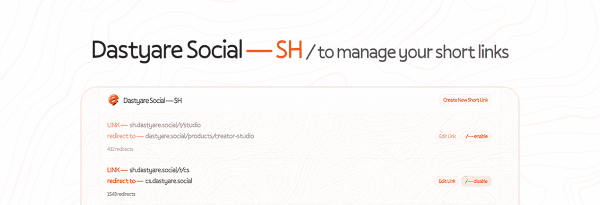
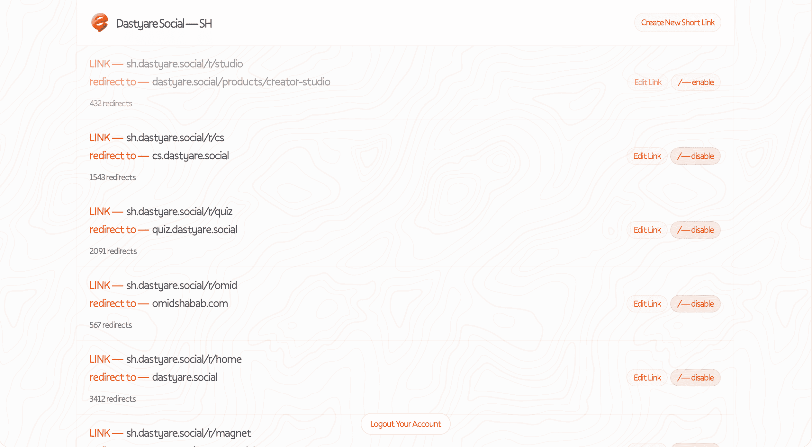
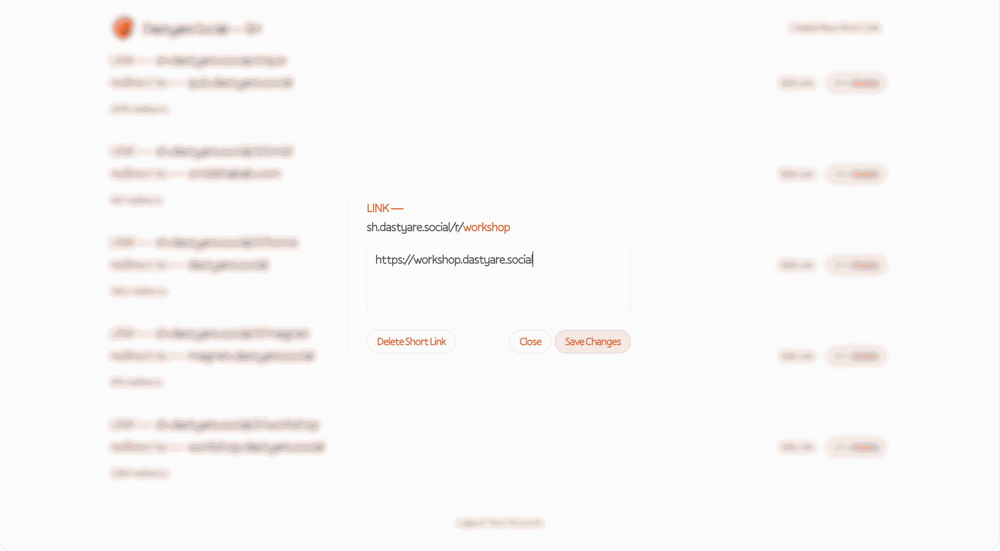
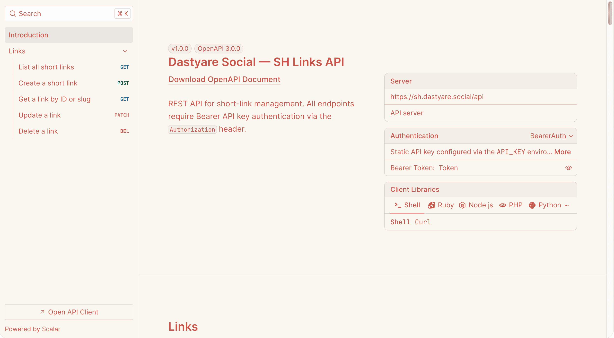

<p align="center">
  
</p>

<h1 align="center">Dastyare SH</h1>

<p align="center">
  The open-source URL shortener you actually want to self-host.
</p>

<p align="center">
  <a href="#quick-start">Quick Start</a> ·
  <a href="#self-hosting">Self-Host</a> ·
  <a href="#api">API</a> ·
  <a href="https://sh.dastyare.social/docs">API Docs</a> ·
  <a href="./SELF-HOSTING.md">Deployment Guide</a>
</p>

<p align="center">
  <a href="https://github.com/omidshabab/sh.dastyare.social/blob/main/LICENSE">
    
  </a>
  <a href="https://github.com/omidshabab/sh.dastyare.social/stargazers">
    
  </a>
  <a href="https://github.com/omidshabab/sh.dastyare.social/network/members">
    
  </a>
  <a href="https://github.com/omidshabab/sh.dastyare.social/issues">
    
  </a>
  
  
</p>

---

## Why Dastyare SH?

You need a short link. You Google "URL shortener." You find Bitly, Short.io, Rebrandly — all SaaS, all with limits, all with your data on their servers. Then you find the open-source ones: most are unmaintained, poorly documented, or require a PhD to deploy.

**Dastyare SH is different.** It's a short-link service that:

- **Takes 30 seconds to deploy** — one Docker command and you're live.
- **Looks good doing it** — a clean, modern dashboard you won't be embarrassed to share.
- **Has a real API** — not an afterthought. Every feature in the dashboard is available via REST with full OpenAPI documentation.
- **Keeps your data yours** — self-hosted on your server, your database, your rules.
- **Actually works in production** — auth, rate limiting, API keys, admin bootstrap. Not a weekend project.

---

## Demo

<p align="center">
  
</p>

<p align="center">
  <em>Create short links with custom slugs, toggle them on/off, and track every redirect.</em>
</p>

<p align="center">
  
  &nbsp;&nbsp;
  
</p>

<p align="center">
  <em>Left: Create a link in one click. Right: Interactive API docs at <code>/docs</code>.</em>
</p>

> **[Try the live demo →](https://sh.dastyare.social)**
>
> Demo mode is enabled — browse the dashboard, explore the API, see how it feels.

---

## Features

| Feature | What it does |
|---------|-------------|
| **Custom slugs** | Choose your own short path, or let the app generate one. |
| **One-click toggle** | Enable or disable any link instantly — no deletion needed. |
| **Click tracking** | Every redirect is counted, atomically, in real time. |
| **REST API** | Full CRUD on links, protected with API keys and rate limiting. |
| **Interactive API docs** | Scalar-powered docs at `/docs`, OpenAPI spec at `/openapi.json`. |
| **Admin bootstrap** | First user is created automatically from environment variables. |
| **Demo mode** | Run a public read-only instance for visitors to explore. |
| **Self-hosted** | Your server, your database, your data. No third parties. |
| **Docker-ready** | Multi-stage build, Docker Compose included, one-command deploy. |
| **Modern stack** | Next.js 16, React 19, TypeScript, Bun, Drizzle ORM, Tailwind CSS. |

---

## Quick Start

### Option 1: Docker (recommended)

```bash
git clone https://github.com/omidshabab/sh.dastyare.social.git
cd sh.dastyare.social
cp .env.example .env   # edit with your values
docker compose up -d --build
```

That's it. The app runs at **http://localhost:2947**. Migrations run automatically on first start, and an admin user is bootstrapped from your `.env` values.

### Option 2: One-command server install

Deploy on a fresh VPS or server with a single command:

```bash
curl -fsSL https://raw.githubusercontent.com/omidshabab/sh.dastyare.social/main/scripts/install.sh | bash
```

This clones the repo, installs Bun, sets up Docker Compose, and starts everything.

### Option 3: From source

```bash
git clone https://github.com/omidshabab/sh.dastyare.social.git
cd sh.dastyare.social
cp .env.example .env   # fill in DATABASE_URL, BETTER_AUTH_URL, etc.
bun install
bun run db:migrate
bun run bootstrap:admin
bun run dev
```

Open **http://localhost:2947** and sign in with the admin credentials from your `.env`.

---

## Self-Hosting

Dastyare SH is designed to be self-hosted. Deploy it on:

- **Any VPS** — DigitalOcean, Hetzner, Linode, AWS EC2, etc.
- **Vercel** — with an external PostgreSQL provider (Neon, Supabase, etc.)
- **Railway** — add a PostgreSQL service, set the start command.
- **Render** — Dockerfile or Node environment, add a managed database.
- **Fly.io, CapRover, Portainer** — any Docker-compatible platform.

For a complete deployment guide covering environment variables, reverse proxies, HTTPS, and platform-specific instructions, see **[SELF-HOSTING.md](./SELF-HOSTING.md)**.

---

## Environment Variables

Copy `.env.example` to `.env` and fill in the values. **Never commit `.env` to source control.**

| Variable | Required | Description |
|----------|----------|-------------|
| `DATABASE_URL` | Yes | PostgreSQL connection string |
| `ADMIN_EMAIL` | Yes | Admin email for bootstrap and sign-in |
| `ADMIN_PASSWORD` | Yes | Admin password (use a strong one) |
| `BETTER_AUTH_URL` | Yes | Public URL of your app (e.g. `https://links.example.com`) |
| `BETTER_AUTH_SECRET` | Yes | Session signing secret (`openssl rand -base64 32`) |
| `API_KEY` | Yes | Shared key for REST API access (`openssl rand -hex 32`) |
| `API_KEY_RATE_LIMIT_MAX_REQUESTS` | No | Max requests per window (default: `30`) |
| `API_KEY_RATE_LIMIT_WINDOW_MS` | No | Rate limit window in ms (default: `60000`) |

Generate secure secrets with:

```bash
openssl rand -base64 32   # for BETTER_AUTH_SECRET
openssl rand -hex 32      # for API_KEY
```

---

## API

Every feature in the dashboard is also available through the REST API. Protect your endpoints with a Bearer token.

### Endpoints

| Method | Endpoint | Description |
|--------|----------|-------------|
| `GET` | `/api/links` | List all short links |
| `POST` | `/api/links` | Create a short link |
| `GET` | `/api/links/{id}` | Get a link by ID or slug |
| `PATCH` | `/api/links/{id}` | Update a link |
| `DELETE` | `/api/links/{id}` | Delete a link |

### Example

```bash
# Create a short link
curl -X POST https://sh.dastyare.social/api/links \
  -H "Authorization: Bearer YOUR_API_KEY" \
  -H "Content-Type: application/json" \
  -d '{"r_to": "https://example.com", "r_path": "example"}'

# Response
{
  "id": "a1b2c3d4e5f6",
  "r_path": "example",
  "r_to": "https://example.com",
  "is_active": true,
  "redirects": 0,
  "createdAt": "2026-08-16T00:00:00.000Z"
}
```

### Documentation

| Resource | URL |
|----------|-----|
| Interactive API docs | [`/docs`](https://sh.dastyare.social/docs) |
| OpenAPI spec (JSON) | [`/openapi.json`](https://sh.dastyare.social/openapi.json) |

---

## Tech Stack

<p align="center">
  <a href="https://nextjs.org">
    
  </a>
  <a href="https://react.dev">
    
  </a>
  <a href="https://www.typescriptlang.org">
    
  </a>
  <a href="https://bun.sh">
    
  </a>
  <a href="https://www.postgresql.org">
    
  </a>
  <a href="https://orm.drizzle.team">
    
  </a>
  <a href="https://www.better-auth.com">
    
  </a>
  <a href="https://trpc.io">
    
  </a>
  <a href="https://tailwindcss.com">
    
  </a>
  <a href="https://biomejs.dev">
    
  </a>
</p>

---

## Architecture

```
src/
├── app/
│   ├── (routes)/
│   │   ├── (main)/           # Dashboard — create, manage, track links
│   │   ├── r/[r_path]/       # Public redirect — countdown then redirect
│   │   └── register/         # Auth — sign up / sign in
│   ├── api/
│   │   ├── links/            # REST API (OpenAPI-documented)
│   │   ├── auth/             # Better Auth handler
│   │   └── trpc/             # Internal tRPC (used by dashboard)
│   └── docs/                 # Scalar API reference UI
├── components/               # React UI components
├── lib/
│   ├── actions/              # Server actions (link operations)
│   ├── api/                  # Shared business logic (used by REST, tRPC, and actions)
│   ├── auth/                 # Better Auth server + client + API key auth
│   ├── db/                   # Drizzle schema + migrations
│   └── trpc/                 # tRPC router (dashboard data layer)
├── store/                    # Zustand stores (modal state, etc.)
└── styles/                   # Global styles (Tailwind)
```

---

## Scripts

| Command | Description |
|---------|-------------|
| `bun run dev` | Start dev server on port 2947 |
| `bun run build` | Production build |
| `bun run start` | Start production server |
| `bun run lint` | Run Biome linter |
| `bun run format` | Format code with Biome |
| `bun run bootstrap:admin` | Create or update admin user from env |
| `bun run db:generate` | Generate migration from schema changes |
| `bun run db:migrate` | Run Drizzle migrations |
| `bun run db:studio` | Open Drizzle Studio (database GUI) |
| `bun run test` | Run tests with Bun |

---

## Contributing

Contributions are welcome! Here's how:

1. Fork the repository
2. Create a feature branch (`git checkout -b feat/my-feature`)
3. Commit your changes (`git commit -m 'feat: add my feature'`)
4. Push to the branch (`git push origin feat/my-feature`)
5. Open a Pull Request

Please read [CONTRIBUTING.md](./CONTRIBUTING.md) for guidelines on code style, testing, and PR expectations.

---

## Releases

Push a version tag to publish a GitHub Release:

```bash
git tag v0.1.0
git push origin v0.1.0
```

Use semantic versions: patch (`v0.1.1`), minor (`v0.2.0`), major (`v1.0.0`).

---

## License

[MIT](./LICENSE) — do whatever you want with it.

---

<p align="center">
  Built by <a href="https://github.com/omidshabab">Dastyare Social</a>
</p>
